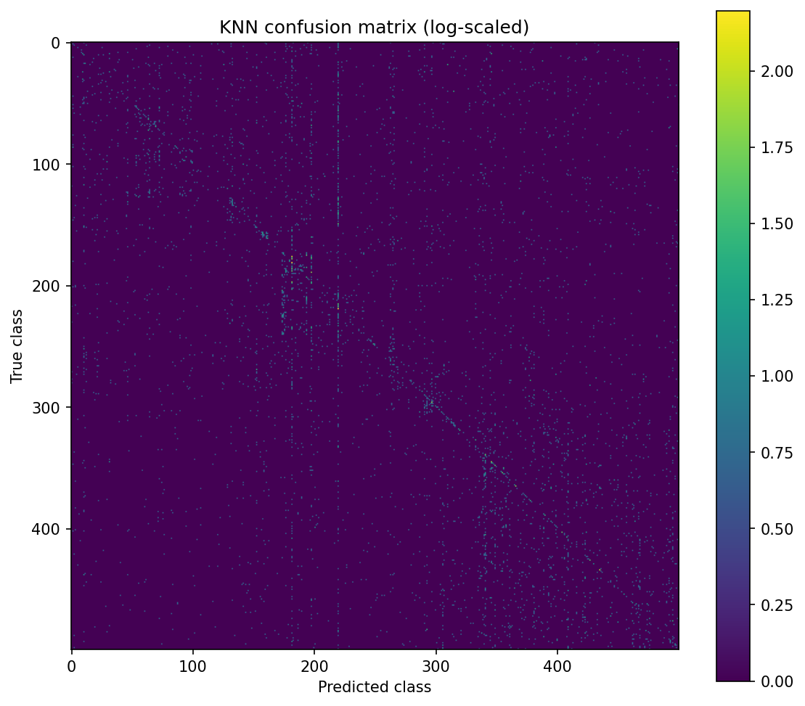
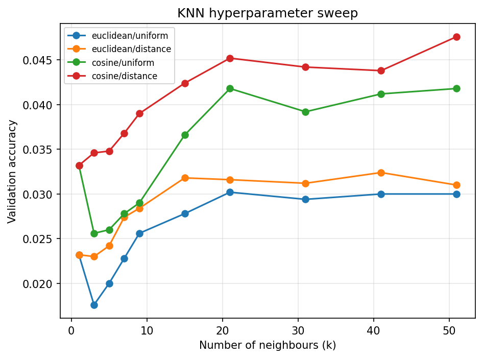
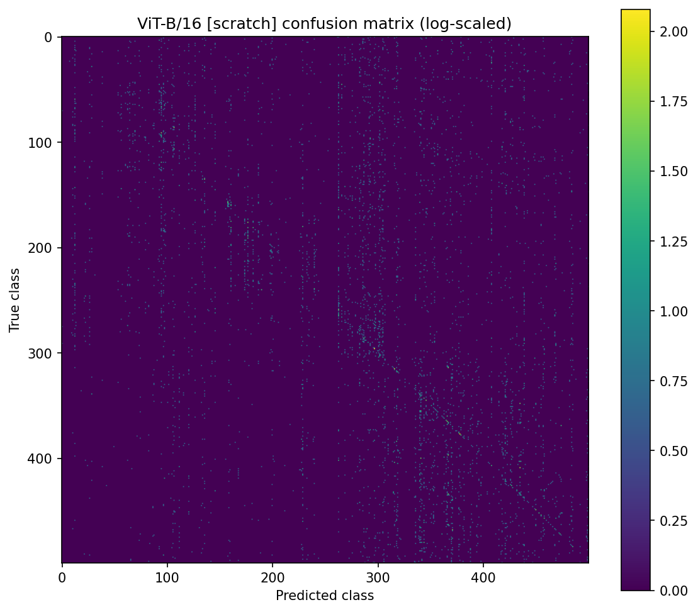
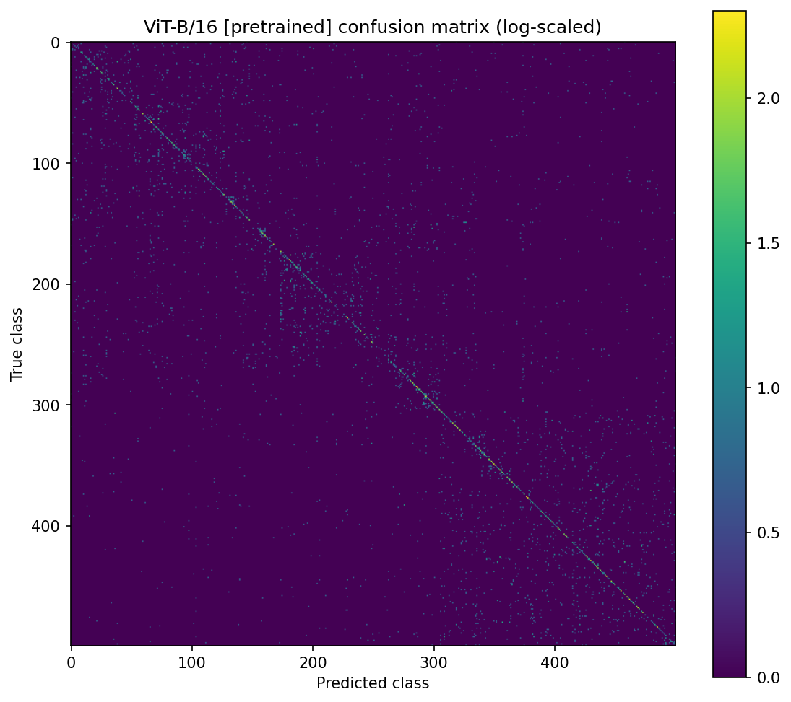

# Fine-Grained Species Classification — Classical Features vs. Vision Transformers

A controlled comparison of three approaches to 500-way fine-grained species classification on **iNaturalist-2021**, built for COMP9517 (Computer Vision) at UNSW.

The question was not "which model wins" but **what actually causes the win**. Holding the dataset, splits, and evaluation fixed, the comparison isolates two variables in turn: handcrafted features versus learned ones, and transformer architecture with and without pretraining.

The answer turned out to be counterintuitive.

---

## Results

Test-set performance on 5,000 held-out images (10 per class, 500 classes). Random chance is 0.2%.

| Model | Top-1 | Top-5 | Balanced acc. | Macro F1 | Train time |
|---|---|---|---|---|---|
| KNN + HOG/LBP/colour | 5.08% | 13.82% | 5.08% | 4.17% | 0.01 s |
| ViT-B/16 — from scratch | 4.50% | 13.14% | 4.50% | 2.77% | 1,646 s |
| ViT-B/16 — pretrained | **23.24%** | **46.56%** | **23.24%** | **21.29%** | 658 s |

---

## The headline finding

**A Vision Transformer trained from scratch performed worse than K-Nearest Neighbours on handcrafted features** — 4.50% against 5.08% — despite consuming roughly 180,000× more training compute (1,646 seconds versus 0.01 seconds).

The same architecture, initialised from pretrained weights instead of randomly, scored **23.24%**. Nothing else changed: same backbone, same data, same augmentation, same optimiser, fewer epochs. The 5× improvement came entirely from initialisation.

A ViT with no pretrained representation is not merely worse than a fine-tuned one — on 20,000 images across 500 classes, it is worse than a nearest-neighbour lookup on colour histograms. Transformers lack the spatial inductive biases that convolutions and handcrafted descriptors provide for free, so they must learn that structure from data, and this dataset is nowhere near large enough for that. **Pretraining, not architecture, is what carries the result.**

---

## Method

### Classical baseline — KNN

Three complementary handcrafted descriptors per image at 128×128:

| Descriptor | Captures | Configuration |
|---|---|---|
| Spatial HSV histogram | Colour, with coarse layout preserved | 8×8×8 bins over a 2×2 grid |
| HOG | Shape and edge structure | 9 orientations, 16×16 px/cell, 2×2 cells/block |
| LBP | Micro-texture — plumage, fur, leaf surface | radius 3, 24 neighbours, uniform |

Each block is **L2-normalised independently** before concatenation, so a high-dimensional block (HOG) cannot dominate the distance computation by length alone. Features then pass through `StandardScaler` and `PCA` to 300 components, both **fitted on the training split only** — validation and test are transformed, never fitted, so no distributional information leaks backwards.

Hyperparameters were grid-searched on validation across k ∈ {1…51}, uniform/distance weighting, and euclidean/cosine metrics. **Winner: k=51, distance weighting, cosine metric.**

### Deep model — ViT-B/16

`timm`'s `vit_base_patch16_224` at 224×224, trained in two configurations: randomly initialised (25 epochs, lr 5e-4) and pretrained (10 epochs, lr 3e-4). Both use AdamW with weight decay 0.05, cosine annealing, label smoothing 0.1, RandAugment on the training split only, and mixed precision. The checkpoint with the best **validation** accuracy is retained for testing, rather than the final epoch.

---

## Discussion

### The KNN failure mode is hubness, and it is visible



The vertical stripes are the story. A handful of classes act as **attractors**, absorbing predictions from across the dataset — class 3338 has recall 0.80 but precision 0.05, and class 4023 has recall 0.80 with precision 0.03. Both retrieve most of their own instances while being wrongly predicted for hundreds of others.

This is *hubness*: in high-dimensional space, some points appear in disproportionately many nearest-neighbour lists, a known pathology of distance-based methods as dimensionality grows. It explains why cosine distance beat euclidean and why distance weighting beat uniform — both partially compensate for the same effect.

### The k-sweep never converged



Validation accuracy was **still climbing at k=51**, the largest value in the grid. The selected hyperparameter sits at the boundary of the search space, which makes k=51 a limit of the experiment rather than a discovered optimum.

### Pretraining changes the shape of the errors, not just their count





The scratch model's confusion matrix has no visible diagonal — its predictions are close to structureless. The pretrained model's diagonal is clearly present. Per-class results shift accordingly: the pretrained model reaches F1 above 0.70 on several classes (0.76, 0.75, 0.74), while the scratch model's best class barely reaches 0.40.

Top-5 accuracy tells the same story from another angle. The scratch model (13.14%) is statistically indistinguishable from KNN (13.82%) — both are guessing within a broad neighbourhood. The pretrained model reaches 46.56%, meaning the correct species is in its top five predictions almost half the time.

### Cost is paid in different places

KNN "training" takes 0.01 seconds because it does nothing but store the matrix — every cost is deferred to inference, at 1.43 ms per image. The ViT spends 658–1,646 seconds training but only 2.63 ms per image at inference. For a lazy learner that gap widens linearly with training-set size, which is the practical argument against KNN at scale regardless of accuracy.

---

## Repository structure

```
README.md
requirements.txt
.gitignore

knn_species_pipeline.py            # classical baseline, end to end
vit_transformer_pipeline.py        # ViT-B/16, scratch and pretrained

knn_metrics.json                   vit_pretrained_metrics.json
knn_classification_report.txt      vit_pretrained_report.txt
knn_confusion_matrix.png           vit_pretrained_confusion.png
knn_k_sweep.png                    vit_pretrained_curves.png

vit_scratch_metrics.json           vit_label_map.json
vit_scratch_report.txt
vit_scratch_confusion.png
vit_scratch_curves.png
```

**Note on class labels:** the KNN report uses the dataset's original `category_id` values; the ViT reports use contiguous indices 0–499, since cross-entropy requires them. `vit_label_map.json` maps between the two.

---

## Running it

```bash
pip install -r requirements.txt
python knn_species_pipeline.py        # CPU-only
python vit_transformer_pipeline.py    # GPU strongly recommended
```

Paths are set in each script's `CONFIG` class:

```python
DRIVE_ROOT   = "path/to/CV_Proj_Dataset"          # label CSVs + tar.gz archives
RESULTS_ROOT = "path/to/results"                  # metrics, figures, checkpoints
```

Both scripts selectively decompress only the ~30k images belonging to the 500-class subset rather than unpacking the full archive, and skip images already present on disk so repeated runs do not rescan.

**Dataset:** iNaturalist-2021, 500-species subset — ~20k train / 5k validation / 5k test. Not included in this repository.

---

## Limitations

- **The KNN grid was bounded too tightly.** k=51 was selected at the edge of the search space while accuracy was still improving.
- **Descriptor weights were never tuned.** Colour, HOG, and LBP contribute at 1.0 each by assumption, not by search.
- **PCA at 300 components was fixed, not selected.** No explained-variance analysis justifies that number.
- **Background bias is unmeasured.** Colour histograms may be keying on habitat rather than the organism; re-running without the colour block would quantify how much.
- **Single validation split, no cross-validation**, so the selected hyperparameters carry more variance than the reported metrics suggest.
- **Learning rate was not swept.** Both ViT configurations use a single hand-chosen rate, and fine-tuning results are sensitive to it.

---

## Attribution

Group project for **COMP9517 Computer Vision**, UNSW Sydney.

This repository contains my contribution: the classical KNN pipeline and the ViT-B/16 comparison — feature engineering, model training, hyperparameter search, and evaluation.

